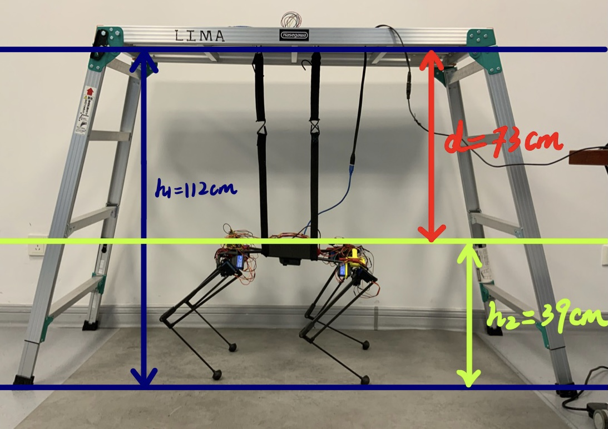

# Experiment (Dec. 23, Wed, Week16, Minimum Support)

## Experimental Setup

* Number of iterations: 50

  * For each iteration (each set of parameters), we perform 3 times, and take the average of the fitness value.

* Support Configuration

  * Ladder top to ground $h1 = 112\ cm$

  * Robot top to ground $h2 = 39\ cm$

  * Ladder top to robot top $d = h1 - h2 = 112 - 39 = 73\ cm$
    * Minimum support: constant $d = 73\ cm$ for all 50 iterations



## Optimization algorithm

Basic continuous Bayesian Optimization

```shell
$ cd BO/Python_code
$ python3 BO.py
```

## Results

Best target and parameters:
